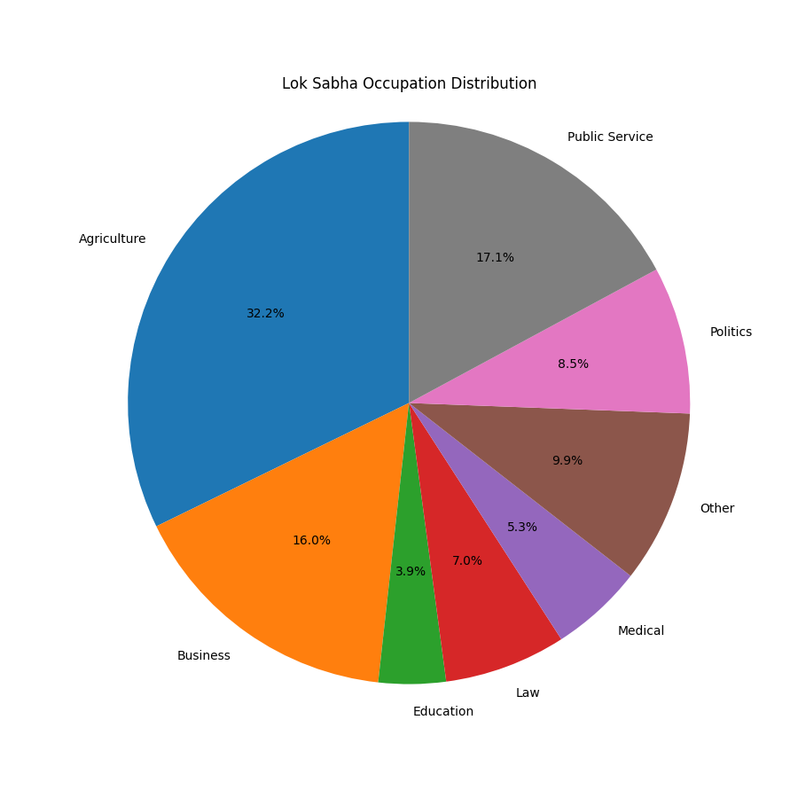
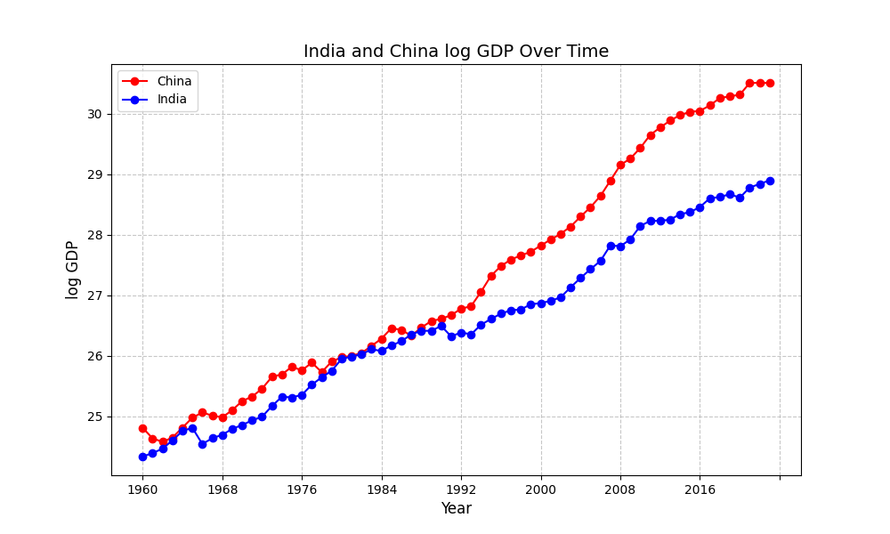

# Analysing Datasets using Python

**Description:** 

In order to demonstrate Python's functionality to read and graph data, I decided to study two datasets of different kinds.

## Occupation Data

The first topic I looked at used data that I had gathered for an ongoing research project, which is to study self reported occupation data of Lok Sabha (Lower House of Parliament) members. In particular, looking at the percentage of self-reported businesspersons. The data was gathered using data reported on the [parliament website](https://sansad.in/ls/members). I have attached the data file that I have compiled [here](https://github.com/RohanSameulMathew/Data-project/blob/main/lok%20sabha%20python.csv).

## India and China GDP comparison

The second topic I looked at was a comparison of India's and China's GDP growth. This graph has been done to death, but I wanted to see how well I could apply skills learnt in my econometrics classes to python, and whether I would be able to replicate the graphs I created in Stata here. [Here](indiagdp.json) are the [datasets](chinagdp.json) I used for this graph.

Finally, here is a link to the instructor's [webpage](https://github.com/mikeizbicki/cmc-csci040/tree/2025spring/project_02_visualizing_datasets)
